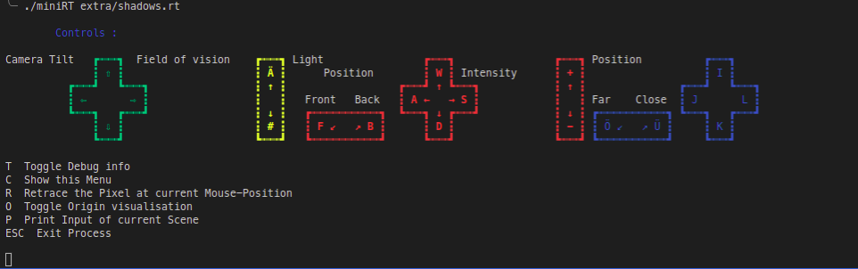
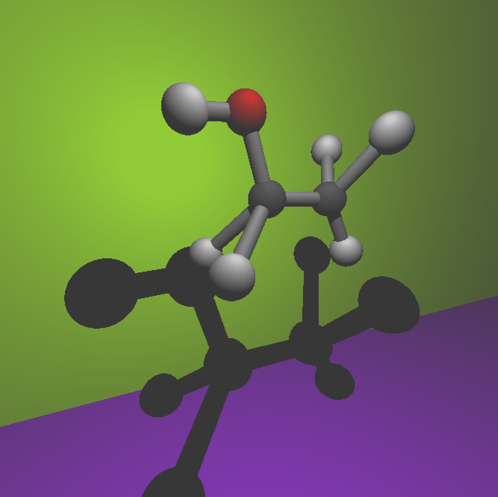
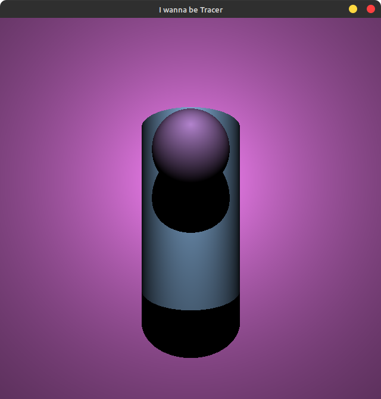

# miniRT

miniRT is a minimal Raytracer for simple geometrical shapes, each with their own lighting system. Their properties and position are described in an .rt file.

## Make and Run

1. Clone the Repository
```
git clone git@github.com:hennneh/miniRT.git
```
2. Compile the program inside the cloned directory with make
```
cd miniRT && make
```
3. Run the program with a .rt file
```
./miniRT extra/scenes/party.rt
```

## Create your own RT File

.rt files need at least one Camera, Ambient Light and Light. The geometric shapes available are planes, cylinders and spheres.

| **Objects**   | **Input**                                            | **Example**                  |
| ------------- | ---------------------------------------------------- | ---------------------------- |
| Camera        | C  [coordinate] [vector] [field of view]             | C  -10,0,0 -1,0,0 90         |
| Ambient Light | A  [brightness] [rgb color]                          | A  0.3 0,255,0               |
| Light         | L  [coordinate] [brightness] [rgb color]             | L 0,-10,10 0.13 255,255,255  |
| Plane         | pl [coordinate] [vector] [rgb color]                 | pl 0,0,0 0,1,0 255,0,255     |
| Sphere        | sp [coordinate] [diameter] [rgb color]               | sp 0,0,0 3 0,0,255           |
| Cylinder      | cy [coordinate] [vector] [diameter] [height] [color] | cy 0,0,0 0,0,1 3 5 145,39,79 |

| **Type**   | ****  |
| ---------- | ----- |
| coordinate | float |
| vector     | float |
| ratio      | float |
| rgb color  | int   |
| diameter   | float |
| height     | float |

## Debugger

To enable the Debugger press T while running the program. It might take a while to render new images, depending on the complexity of the scene. 


---
## Examples




